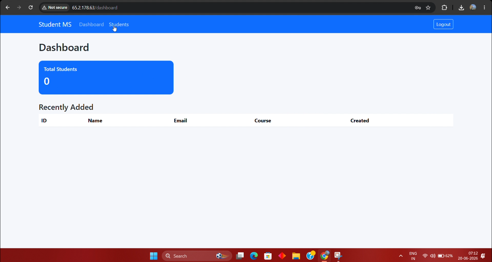

# 🎓 Student Management System

A full-stack **Student Management System** built with **Spring Boot, Thymeleaf, MySQL, Maven, AWS EC2, Amazon RDS, and Jenkins CI/CD**.

This project demonstrates not only application development, but also how to **build, test, package, and deploy a Spring Boot application to AWS automatically using Jenkins**.

> 🚀 **CI/CD:** GitHub → Jenkins → Application EC2 → RDS MySQL  
> ☁️ **Cloud:** AWS  
> 🔄 **Deployment:** Jenkins + SSH/SCP + systemd  
> 🐳 **Docker:** Not used in the current deployment

---

## 📌 Project Overview

The Student Management System provides a web-based interface for managing student records.

The application is deployed on an **AWS EC2 Application Server**, while student data is stored in **Amazon RDS for MySQL**.

Jenkins is hosted on a separate EC2 instance and automatically:

1. Checks out the source code from GitHub
2. Builds and tests the application using Maven
3. Creates the Spring Boot JAR
4. Archives the build artifact
5. Transfers the JAR to the Application EC2 using SSH/SCP
6. Installs the new JAR
7. Restarts the systemd service
8. Verifies that the application service is running

---

# 🏗️ AWS Architecture

### Architecture Diagram


### Application Flow

```text
                         Developer
                             |
                             | git push
                             v
                    +----------------+
                    |    GitHub      |
                    | Student Repo   |
                    +-------+--------+
                            |
                          HTTPS
                            |
                            v
                    +----------------+
                    |   Jenkins EC2  |
                    |                |
                    | Jenkins        |
                    | Java 21        |
                    | Maven          |
                    +-------+--------+
                            |
                         SSH / SCP
                            |
                            v
                    +----------------+
                    | Application EC2|
                    |                |
                    | Java 21        |
                    | Spring Boot    |
                    | Port 8080      |
                    | systemd        |
                    +-------+--------+
                            |
                         JDBC :3306
                            |
                            v
                    +----------------+
                    |   Amazon RDS   |
                    |     MySQL      |
                    |   studentdb    |
                    +----------------+
```

The Jenkins-to-Application Server deployment uses SSH/SCP, while GitHub source checkout and application deployment are separate connections.

---

# 🎥 Project Demo

## ▶️ Application Demo

# 🎥 Project Demo

## ▶️ Application Demo

[](docs/videos/application-demo.mp4)

> Click the preview above to watch the full application demo.


The demo shows the Student Management application running and demonstrates the main application workflow.

### 🎬 Additional Demo

You can also find the Jenkins CI/CD demonstration in:

```text
docs/videos/jenkins-cicd-demo.mp4
```

---

# 📸 Application Screenshots

## 🔐 Login


## 📊 Dashboard


## 👨‍🎓 Student List


## ➕ Add Student


---

# 🚀 CI/CD Pipeline

The project uses **Jenkins Pipeline** to automate the application build and deployment process.

### Pipeline Flow

```text
                    GitHub
                       |
                       v
                  ┌─────────┐
                  │ Checkout│
                  └────┬────┘
                       |
                       v
              ┌────────────────┐
              │ Maven Build &  │
              │     Test       │
              └───────┬────────┘
                      |
                      v
              ┌────────────────┐
              │ Create Spring  │
              │  Boot JAR      │
              └───────┬────────┘
                      |
                      v
              ┌────────────────┐
              │ Archive JAR    │
              │   Artifact     │
              └───────┬────────┘
                      |
                      v
              ┌────────────────┐
              │ SSH / SCP      │
              │ Deployment     │
              └───────┬────────┘
                      |
                      v
              ┌────────────────┐
              │ Install JAR on │
              │ Application EC2│
              └───────┬────────┘
                      |
                      v
              ┌────────────────┐
              │ Restart        │
              │ systemd        │
              └───────┬────────┘
                      |
                      v
              ┌────────────────┐
              │ Verify Service │
              │    Active      │
              └────────────────┘
```

The implemented Jenkins stages are:

| Stage | Purpose |
|---|---|
| Checkout | Pull source code from GitHub |
| Build and Test | Run `mvn -B clean verify` |
| Archive Artifact | Store the generated JAR in Jenkins |
| Deploy | Transfer JAR to Application EC2 |
| Restart | Restart `student-management.service` |
| Verify | Confirm the service is active |

---

# 🔄 Jenkins Deployment

The Jenkins pipeline uses an SSH credential:

```text
student-management-app-ssh
```

The application server receives the generated JAR through SCP.

The deployment location is:

```text
/opt/student-management/student-management.jar
```

After deployment, Jenkins executes:

```text
sudo systemctl restart student-management
```

and verifies that the service is active.

---

# ☁️ AWS Infrastructure

The project uses the following AWS components:

| AWS Service | Purpose |
|---|---|
| Amazon VPC | Network environment |
| Amazon EC2 | Jenkins server |
| Amazon EC2 | Application server |
| Amazon RDS | MySQL database |
| Security Groups | Network access control |
| Subnets | Network segmentation |
| Route Tables | Network routing |
| Internet Gateway | Internet connectivity |

### Database Connectivity

```text
Application EC2
      |
      | TCP 3306
      v
Amazon RDS MySQL
      |
      v
   studentdb
```

The RDS security group is designed to allow MySQL traffic from the Application Server security group rather than opening port `3306` to the entire internet.

---

# 🗄️ Database Configuration

The Spring Boot application supports environment variables for database configuration:

```properties
spring.datasource.url=jdbc:mysql://${DB_HOST:localhost}:${DB_PORT:3306}/${DB_NAME:studentdb}?useSSL=false&serverTimezone=UTC&allowPublicKeyRetrieval=true

spring.datasource.username=${DB_USER:root}

spring.datasource.password=${DB_PASSWORD:root}
```

Production deployment uses environment variables rather than committing database credentials into the source code.

Example:

```text
DB_HOST=<RDS_ENDPOINT>
DB_PORT=3306
DB_NAME=studentdb
DB_USER=<RDS_USERNAME>
DB_PASSWORD=<RDS_PASSWORD>
```

> 🔐 **Never commit real database passwords, private keys, or other secrets to GitHub.**

---

# ⚙️ Application Service

The application runs as a Linux `systemd` service.

Service:

```text
student-management.service
```

Application directory:

```text
/opt/student-management
```

JAR:

```text
/opt/student-management/student-management.jar
```

Application port:

```text
8080
```

The service runs the Spring Boot JAR using Java 21 and automatically restarts if the process exits.

Useful commands:

```bash
sudo systemctl status student-management
```

```bash
sudo systemctl restart student-management
```

```bash
sudo journalctl -u student-management -n 50 --no-pager
```

---

# 🧰 Technology Stack

### Application

- ☕ Java 21
- 🌱 Spring Boot
- 🎨 Thymeleaf
- 🗄️ MySQL
- 📦 Maven

### DevOps

- 🔄 Jenkins
- 🔗 Git
- 🐙 GitHub
- 🔐 SSH
- 📡 SCP
- ⚙️ systemd

### AWS

- ☁️ Amazon EC2
- 🗄️ Amazon RDS for MySQL
- 🌐 Amazon VPC
- 🔐 Security Groups
- 🛣️ Route Tables
- 🌍 Internet Gateway

---

# 📁 Project Structure

```text
Student-management/
│
├── docs/
│   ├── architecture/
│   │   └── student-management-architecture.png
│   │
│   ├── screenshots/
│   │   ├── login.png
│   │   ├── dashboard.png
│   │   ├── student-list.png
│   │   ├── add-student.png
│   │   └── application-demo-thumbnail.png
│   │
│   └── videos/
│       ├── application-demo.mp4
│       └── jenkins-cicd-demo.mp4
│
├── src/
│   ├── main/
│   │   ├── java/
│   │   └── resources/
│   │
│   └── test/
│
├── Jenkinsfile
├── pom.xml
├── README.md
└── .gitignore
```

---

# 💻 Run Locally

### 1. Clone the repository

```bash
git clone https://github.com/PriteshBiradar/Student-management.git
```

```bash
cd Student-management
```

### 2. Build the application

```bash
mvn clean verify
```

### 3. Run the application

```bash
mvn spring-boot:run
```

The application runs on:

```text
http://localhost:8080
```

For a local MySQL setup, configure the required database environment variables before starting the application.

---

# 🧪 Testing

The Jenkins pipeline runs:

```bash
mvn -B clean verify
```

This allows the project to compile, execute tests, and verify the application before deployment.

Only after the build/test stage succeeds does Jenkins continue with artifact archiving and deployment.

---

# 🔐 Security Practices

This project demonstrates several basic security practices:

- Database is hosted separately using Amazon RDS.
- RDS is not intended to be publicly exposed.
- MySQL access is restricted through Security Groups.
- SSH deployment uses a dedicated Jenkins credential.
- Database configuration is supplied through environment variables.
- Private SSH keys are not stored in the repository.
- Sensitive values should not be committed to Git.

> ⚠️ This is a learning/project environment. Production deployments should further restrict SSH and application access, use private networking where appropriate, and use services such as AWS Systems Manager and Secrets Manager/Parameter Store.

---

# 🛠️ Useful Troubleshooting Commands

### Check application service

```bash
sudo systemctl status student-management --no-pager
```

### Check application logs

```bash
sudo journalctl -u student-management -n 100 --no-pager
```

### Check port 8080

```bash
sudo ss -lntp | grep 8080
```

### Test the application locally on EC2

```bash
curl -I http://localhost:8080
```

Expected application response may redirect to the login page.

### Test RDS connectivity

```bash
mysql -h <RDS_ENDPOINT> -P 3306 -u <RDS_USER> -p
```

The deployment setup specifically uses these checks for verifying the application, port `8080`, and EC2-to-RDS connectivity.

---

# 🎯 Key DevOps Concepts Demonstrated

This project provided hands-on experience with:

- AWS EC2 administration
- Amazon RDS
- VPC networking
- Security Groups
- Linux administration
- SSH authentication
- Jenkins Pipeline
- CI/CD
- Maven builds
- Artifact archiving
- SCP-based deployment
- systemd services
- Environment variables
- Application-to-database connectivity
- Git/GitHub workflow
- Automated deployment

---

# 🧠 What I Learned

Through this project, I gained practical experience in connecting **application development with cloud infrastructure and DevOps automation**.

The major learning areas were:

- Deploying Spring Boot applications on AWS EC2
- Connecting an EC2 application to Amazon RDS MySQL
- Configuring Linux systemd services
- Building applications with Maven
- Creating Jenkins pipelines
- Using SSH credentials securely in Jenkins
- Automating JAR deployment using SCP
- Troubleshooting EC2-to-RDS connectivity
- Managing application configuration using environment variables
- Understanding a basic end-to-end CI/CD workflow

---

# 🔮 Future Improvements

Possible improvements for a more production-oriented architecture:

- Add an Application Load Balancer
- Move the application server into a private subnet
- Add Auto Scaling
- Use AWS Systems Manager instead of direct SSH where appropriate
- Store secrets in AWS Secrets Manager or Parameter Store
- Add CloudWatch monitoring and alarms
- Add automated rollback
- Add deployment approval stages
- Add blue/green or rolling deployments
- Add infrastructure provisioning through Terraform
- Add separate development and production environments

---

# 👨‍💻 Author

## Pritesh Biradar

**AWS / DevOps Learner**

Interested in:

- ☁️ AWS Administration
- 🔧 DevOps
- 🔄 CI/CD
- 🏗️ Infrastructure as Code
- 🌱 Jenkins
- 🐧 Linux
- ☕ Java / Spring Boot
- 🗄️ Cloud Databases

### 🌐 Portfolio

**[Pritesh Biradar Portfolio](https://priteshbiradar.github.io/Pritesh_Biradar.github.io/)**

### 📦 Repository

**[Student Management System](https://github.com/PriteshBiradar/Student-management)**

---

<p align="center">

### 🚀 Built with Spring Boot + AWS + Jenkins

**Application Development • Cloud • CI/CD • DevOps**

</p>