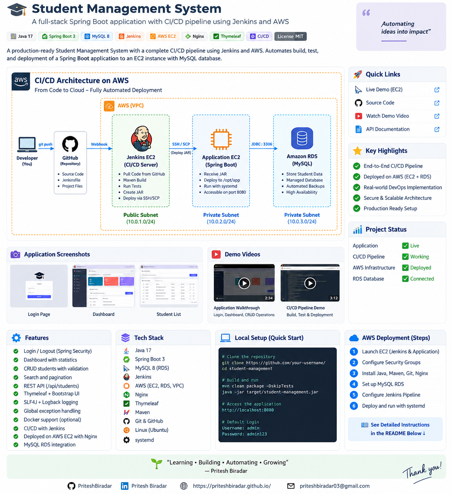
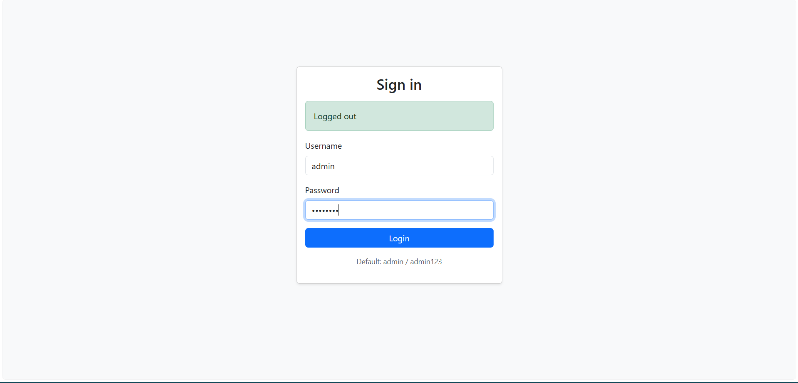
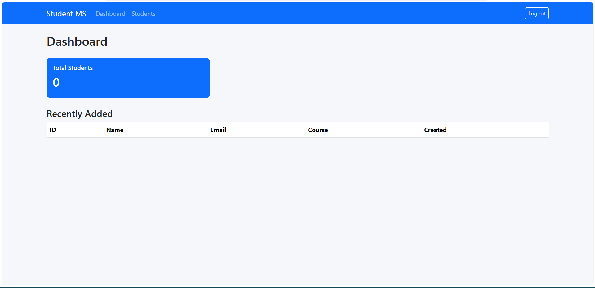
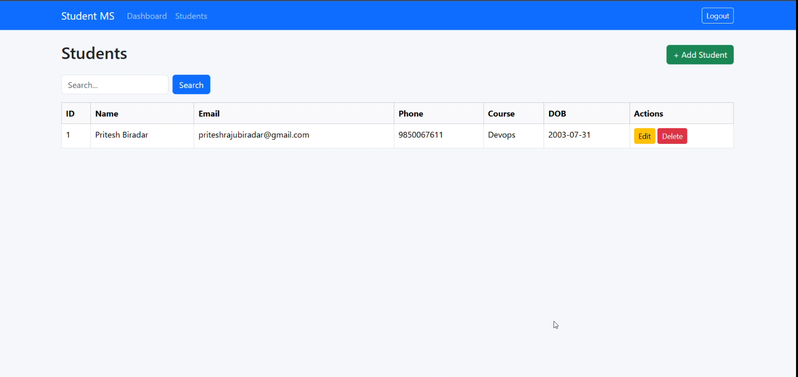
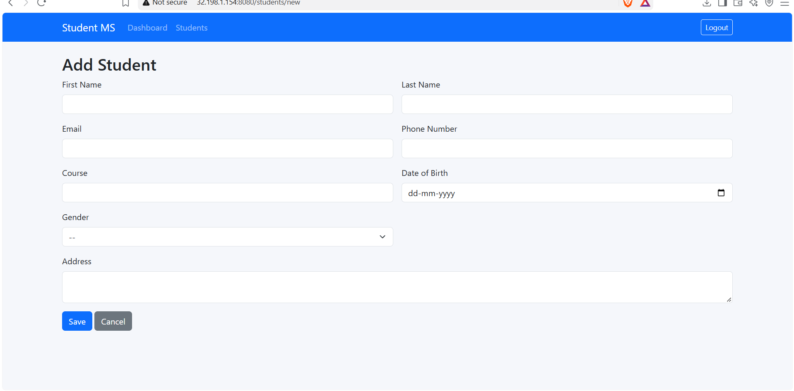

# 🎓 Student Management System

> A full-stack Student Management System built with **Spring Boot, Thymeleaf, MySQL, Jenkins, and AWS**, with an automated CI/CD pipeline for building, testing, and deploying the application to an AWS EC2 server.


---

## 📌 Project Overview

The **Student Management System** is a web-based application for managing student records through a simple and user-friendly interface.

The project was also used as a practical **DevOps / AWS deployment project**, where the application is automatically built, tested, packaged, and deployed using **Jenkins**.

### 🚀 CI/CD Flow

```text
Developer
    │
    │ Git Push
    ▼
 GitHub
    │
    │ Checkout
    ▼
 Jenkins EC2
    │
    ├── Maven Build
    ├── Run Tests
    ├── Create JAR
    └── Archive Artifact
    │
    │ SSH / SCP
    ▼
Application EC2
    │
    ├── Deploy JAR
    ├── systemd Restart
    └── Spring Boot :8080
    │
    │ JDBC :3306
    ▼
Amazon RDS
   MySQL
```

---

# 🏗️ AWS CI/CD Architecture

The application is deployed on AWS using separate EC2 instances for the Jenkins CI/CD server and the application server, while **Amazon RDS MySQL** is used for persistent database storage.



### Architecture Components

| Component | Purpose |
|---|---|
| **GitHub** | Source code repository |
| **Jenkins EC2** | CI/CD automation server |
| **Application EC2** | Hosts the Spring Boot application |
| **Amazon RDS MySQL** | Managed relational database |
| **Maven** | Build and test automation |
| **SSH/SCP** | Application deployment |
| **systemd** | Application process management |
| **Spring Boot** | Backend application |
| **Thymeleaf** | Server-side UI |
| **Nginx** | Reverse proxy / web server |

---

# ✨ Key Features

- 🔐 Login and authentication using Spring Security
- 📊 Dashboard with student information
- 👨‍🎓 Student CRUD operations
- ➕ Add new students
- ✏️ Update student information
- 🗑️ Delete student records
- 🔍 Search functionality
- 📄 Pagination
- 🌐 REST API for student operations
- 🗄️ MySQL database integration
- ☁️ AWS EC2 deployment
- 🛢️ Amazon RDS MySQL database
- 🔄 Jenkins CI/CD pipeline
- 📦 Maven-based build
- 🚀 Automated JAR deployment using SSH/SCP
- ⚙️ systemd service management
- 📝 Application logging and error handling

---

# 🛠️ Technology Stack

### Application

- Java 21
- Spring Boot 3
- Spring MVC
- Spring Security
- Thymeleaf
- Bootstrap
- MySQL
- REST APIs
- Maven

### DevOps & Cloud

- AWS EC2
- Amazon RDS
- AWS VPC
- Jenkins
- Git
- GitHub
- SSH
- SCP
- Linux / Ubuntu
- systemd
- Nginx

---

# 🔄 CI/CD Pipeline

The project implements a Jenkins-based CI/CD pipeline.

### Pipeline Flow

```text
GitHub
   ↓
Checkout
   ↓
Maven Clean Verify
   ↓
Run Tests
   ↓
Create Spring Boot JAR
   ↓
Archive Artifact
   ↓
SSH to Application EC2
   ↓
SCP JAR
   ↓
Install JAR
   ↓
Restart systemd Service
   ↓
Verify Application
```

### Jenkins Pipeline Stages

#### 1️⃣ Checkout

Jenkins checks out the latest source code from the GitHub repository.

#### 2️⃣ Build & Test

Maven is used to build the application and execute the test lifecycle.

```bash
mvn -B clean verify
```

#### 3️⃣ Archive Artifact

The generated Spring Boot JAR is archived by Jenkins for build tracking.

#### 4️⃣ Deploy

Jenkins connects to the application EC2 server using SSH credentials and transfers the JAR using SCP.

#### 5️⃣ Restart Application

The deployment process installs the new JAR and restarts the systemd service.

```bash
sudo systemctl restart student-management
```

#### 6️⃣ Verification

Jenkins verifies that the service is running successfully after deployment.

```bash
sudo systemctl is-active --quiet student-management
```

---

# 📸 Application Screenshots

## 🔐 Login



---

## 📊 Dashboard



---

## 👨‍🎓 Student Management



---

## ➕ Student Form



---

# 🎥 Project Demo

## 🎥 Application Demo

[](https://youtu.be/Frmffy9lOsI)

Click the image above to view the complete application demo.

The application demo demonstrates:

- Login
- Dashboard
- Student management
- CRUD operations
- Search
- Application navigation

---


# ☁️ AWS Deployment

The application is deployed using AWS infrastructure.

### AWS Resources

```text
AWS VPC
│
├── Public Subnet
│   ├── Jenkins EC2
│   └── Application EC2
│
└── Database Subnets
    └── Amazon RDS MySQL
```

### Jenkins EC2

Jenkins runs on an AWS EC2 instance and is responsible for:

- Pulling source code
- Running Maven builds
- Running tests
- Creating the JAR
- Deploying the application
- Verifying deployment

### Application EC2

The application server:

- Runs Ubuntu Linux
- Runs Java 21
- Hosts the Spring Boot JAR
- Uses systemd for process management
- Exposes the Spring Boot application on port `8080`
- Connects to Amazon RDS through MySQL port `3306`

### Amazon RDS

Amazon RDS MySQL provides the persistent database for the application.

```text
Application EC2
      │
      │ JDBC :3306
      ▼
Amazon RDS
    MySQL
```

The database is configured so that the application server can connect to it through the appropriate security-group rules.

---

# ⚙️ Application Configuration

The application uses environment variables for production database configuration.

Example:

```properties
spring.datasource.url=jdbc:mysql://${DB_HOST:localhost}:${DB_PORT:3306}/${DB_NAME:studentdb}?useSSL=false&serverTimezone=UTC&allowPublicKeyRetrieval=true
spring.datasource.username=${DB_USER:root}
spring.datasource.password=${DB_PASSWORD:root}
```

### Production Environment

```text
DB_HOST=<RDS-ENDPOINT>
DB_PORT=3306
DB_NAME=studentdb
DB_USER=<database-user>
DB_PASSWORD=<database-password>
```

> ⚠️ Never commit real database passwords, private SSH keys, `.env` files, or other credentials to GitHub.

---

# 💻 Run Locally

## Prerequisites

Install:

- Java 21
- Maven
- Git
- MySQL

Check versions:

```bash
java -version
mvn -version
git --version
```

---

## Clone Repository

```bash
git clone https://github.com/PriteshBiradar/Student-management.git
cd Student-management
```

---

## Configure Database

Create the database:

```sql
CREATE DATABASE studentdb;
```

Configure the database connection using your local environment variables or application configuration.

---

## Build the Application

```bash
mvn clean verify
```

---

## Run the Application

```bash
java -jar target/student-management.jar
```

The application runs on:

```text
http://localhost:8080
```

---

# 🔌 REST API

The application provides REST endpoints for student management.

| Method | Endpoint | Description |
|---|---|---|
| GET | `/api/students` | List students |
| GET | `/api/students/{id}` | Get student |
| POST | `/api/students` | Create student |
| PUT | `/api/students/{id}` | Update student |
| DELETE | `/api/students/{id}` | Delete student |

Example:

```text
GET /api/students
```

---

# 📁 Project Structure

```text
Student-management/
│
├── src/
│   ├── main/
│   │   ├── java/
│   │   └── resources/
│   │
│   └── test/
│
├── deploy/
│
├── docs/
│   ├── architecture/
│   │   └── student-management-architecture.png
│   │
│   ├── screenshots/
│   │   ├── login.png
│   │   ├── dashboard.png
│   │   ├── student-list.png
│   │   └── add-student.png
│   │
│   └── videos/
│       ├── application-demo.mp4
│       └── jenkins-cicd-demo.mp4
│
├── Jenkinsfile
├── pom.xml
├── .gitignore
└── README.md
```

---

# 🔐 Security Considerations

The project follows several basic security practices:

- 🔑 SSH access should be restricted to trusted IP addresses
- 🛡️ AWS Security Groups control inbound traffic
- 🔒 Database access is restricted to the application server
- 🚫 Database should not be publicly accessible
- 🔐 Production credentials should be stored outside source code
- 🔄 SSH keys should be managed securely
- 🗝️ Database credentials should be rotated periodically

For production environments, AWS Secrets Manager or SSM Parameter Store can be used for centralized secret management.

---

# 🧪 Troubleshooting

### Check Application Status

```bash
sudo systemctl status student-management
```

### View Application Logs

```bash
sudo journalctl -u student-management -f
```

### Check Port 8080

```bash
sudo ss -lntp | grep 8080
```

### Test Application Locally

```bash
curl -I http://localhost:8080
```

### Check RDS Connectivity

```bash
nc -zv <RDS-ENDPOINT> 3306
```

---

# 🎯 What I Learned From This Project

This project helped me gain practical experience in:

- AWS EC2 provisioning and configuration
- Amazon RDS MySQL
- VPC and Security Groups
- Linux server administration
- Java application deployment
- Maven build automation
- Jenkins CI/CD
- Git and GitHub
- SSH key-based authentication
- SCP-based deployment
- systemd service management
- Application troubleshooting
- Database connectivity troubleshooting
- CI/CD pipeline debugging

---

# 🚀 Future Improvements

Possible improvements for the project:

- [ ] HTTPS using SSL/TLS
- [ ] AWS Application Load Balancer
- [ ] Auto Scaling
- [ ] CloudWatch monitoring
- [ ] AWS Secrets Manager
- [ ] Blue/Green deployment
- [ ] Automated rollback
- [ ] Infrastructure as Code with Terraform
- [ ] Jenkins webhook-based automatic deployment
- [ ] Automated integration testing

---

# 📊 Project Highlights

```text
┌──────────────────────────────────────────┐
│        STUDENT MANAGEMENT SYSTEM         │
├──────────────────────────────────────────┤
│                                          │
│  ☁️ AWS Deployment                       │
│  🔄 Jenkins CI/CD                        │
│  ☕ Spring Boot                           │
│  🗄️ MySQL RDS                            │
│  🐧 Linux / Ubuntu                       │
│  🔐 SSH/SCP Deployment                   │
│  ⚙️ systemd                              │
│  📦 Maven                                │
│                                          │
└──────────────────────────────────────────┘
```

---

# 👨‍💻 Author

## Pritesh Biradar

AWS / DevOps enthusiast focused on building practical cloud infrastructure, CI/CD pipelines, and production-style deployments.

### GitHub

[](https://github.com/PriteshBiradar)

### Portfolio

[](https://priteshbiradar.github.io/Pritesh_Biradar.github.io/)

---

## ⭐ If you found this project useful

Feel free to ⭐ the repository and explore the implementation.

---

### 🚀 Learning • Building • Automating • Growing
**Built by Pritesh Biradar**